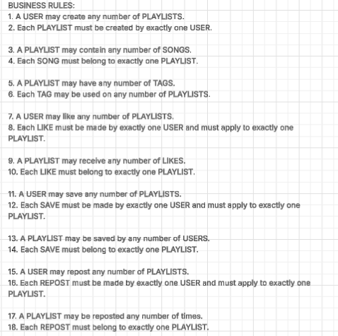
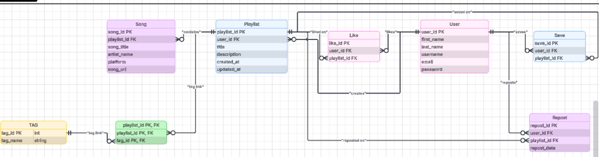
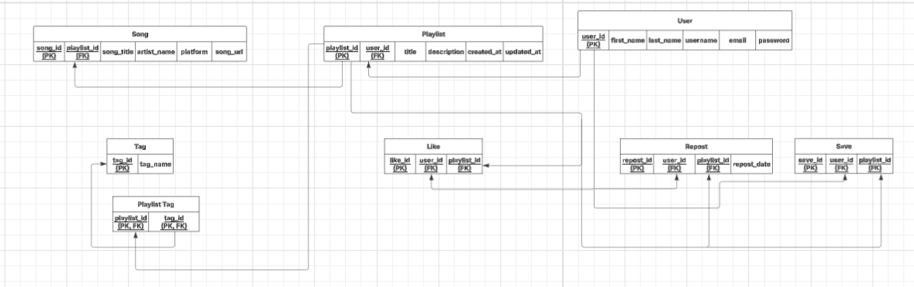

My website is a unifed music playlist sharing network platform
with the context that there is a ton of music in the world and online so there a ton of websites 
where you can realease and stream music online however not all musical artists post all of their 
music on the same websites or platforms. Even though big artists will release their music on 
almost every platform, especially Spotify and Youtube, many small and underground artists don't 
release their entire discography on these websites for personal, anticorporate, or financial 
reasons. If you love an artist or a genre of music, its not always easy to discover more the 
said topic. Thats why on this website, users of all ages can create and share playlists of music 
with links directly to the song on any platform it was released on. The idea is to have playlists
of links so that users can discover and explore more music that may not be on the platform they
tend to use daily. 

Users can create and post playlists, title them whatever they want, and can add a description and 
tags (music genres, tone, mood) to the playlist to give other users viewing the playlist more 
context of what the playlist entails. Liking, resposting, and saving function would also be good 
for the user to have. They should also be able to edit their own playslists whenever they please.

## Entities

The main entities for this project are:

- USER
- PLAYLIST
- SONG
- TAG
- PLAYLIST_TAG
- LIKE
- SAVE
- REPOST

## Business Rules 
The relationship diagram shows how the main tables in the database connect to each other using primary keys and foreign keys. In this project, the User table connects to playlists, likes, saves, and reposts through user_id. The Playlist table connects to songs, tags, likes, saves, and reposts through playlist_id. This diagram helps show how user accounts, playlist posts, song links, and user interactions work together in the database.

## ERD
The ERD shows the overall database design for the unified music playlist sharing platform. It includes the main entities, such as User, Playlist, Song, Tag, Like, Save, and Repost, along with their attributes and cardinalities. The ERD helps explain the structure of the website by showing what information needs to be stored and how each part of the system is related.

## Relations Diagram
The relationship diagram shows how the main tables in the database connect to each other using primary keys and foreign keys. In this project, the User table connects to playlists, likes, saves, and reposts through user_id. The Playlist table connects to songs, tags, likes, saves, and reposts through playlist_id. This diagram helps show how user accounts, playlist posts, song links, and user interactions work together in the database.

